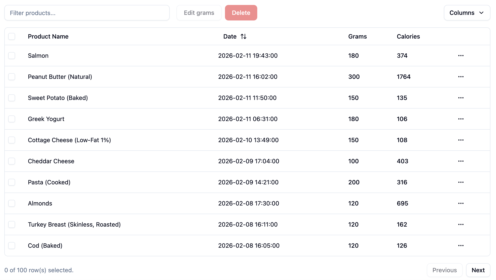
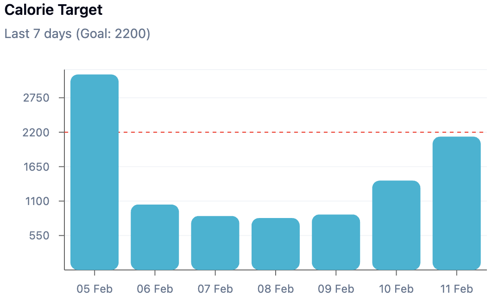
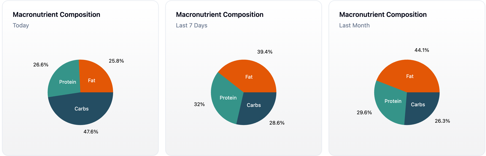

# Eatr - Nutrition Tracker

[Try it!](https://rafis.us)

Eatr is a full-stack nutrition tracker for logging meals by scanning barcodes or entering them manually. Users set a daily calorie intake goal, and visualize macronutrient distribution and calorie intake for different time periods with charts. The login page includes a live demo(no registration) with randomly seeded data, so the functionality of the app is immediately explorable.

**Food Log Table**: Browse every food item you’ve logged in one place.
Quickly sort, edit, or delete entries to keep your data accurate.



**Weekly Calorie Progress**: A bar chart depicts how your daily intake compares to your calorie goals across the week.



**Macro Distribution**: Pie charts illustrate how your calories are split between protein, carbs, and fats.



## Tech Stack

- Frontend: TypeScript, React, Tailwind, shadcn/ui, Recharts
- Backend: Python, Flask, SQLite

Self-hosted CI/CD pipeline with atomic frontend deploys and user-level systemd backend services.
In my app, I'm using a session with a CSRF token. 
Deployed with gunicorn and nginx.


## Future Improvements

- Improve scanner function on phones.
- Switch to Postgres.
- Add more features to the user profile.

## Getting Started

### 1) Install dependencies

Frontend:

```
npm install
```

Backend:

```
pip install -r requirements.txt
```

### 2) Initialize databases(First time only)

```
python backend/init_db.py
```

### 3) Run the servers

Backend:

```
python app.py
```

Frontend:

```
npm run dev
```

